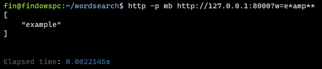
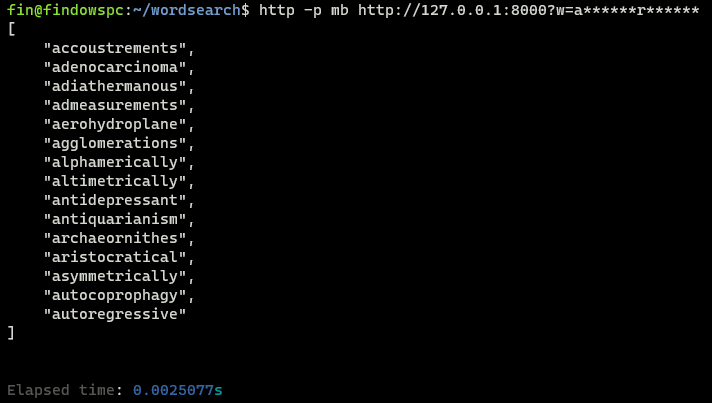

# Wordsearch

Puzzle solver tool for wordle or crosswords. Built with Deno.

No dependencies outside of the Deno standard library :)

Can look through ~200k words and find matches with 10 wildcard characters within 0.14ms. (See `/database/benchmark`, still need to verify this works as intended)

## Database

Contains a CLI for building indexes

### TODO:

- Reduce block and index size (not every index needs to be a `Range` array).
- Fix when all characters are wildcards throwing error.

## Service

Backend service for making requests

## Notes

Don't judge code I wrote this as quick as possible